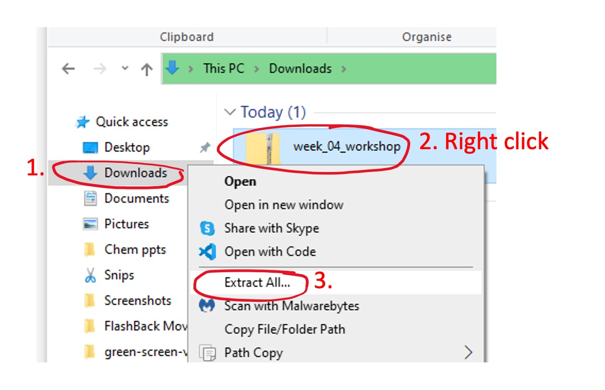
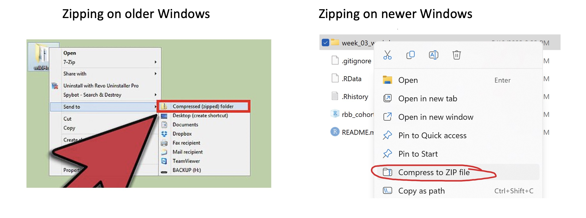

```{r include = FALSE}
# packages
if(!require(pacman)) install.packages("pacman")
pacman::p_load(tidyverse, here, patchwork, janitor, esquisse, flextable)
```

# Assignment Instructions

1.  First download the course repo [here](https://minhaskamal.github.io/DownGit/#/home?url=https://github.com/the-graph-courses/rbb_cohort_1_materials/tree/main/week_04_workshop) or by clicking on the relevant button on the assignment page.

2.  If you are on a PC, go into your downloads folder, right click on the zip file downloaded, and click on "extract all". (If you are on a Mac, you can directly click on the downloaded folder)

    {width="477"}

3.  Then click on the RStudio Project file in the unzipped folder to open the project in RStudio.

    {width="348"}

4.  From the Files pane of RStudio, explore the "data" and "rmd" subfolders.

    {width="590"}

5.  In the "rmd" sub-folder, the instructions for your exercise are outlined (these are the same instructions you see here). There is also an example report which you can use for reference.

6.  In the "data" sub-folder, the dataset you will be working on is called "india_tb_pathways_and_costs.csv". The other dataset is for example purposes only.

7.  **Your task will be to create a short rmarkdown-based report comparing the distribution of TWO CATEGORICAL variables in the india TB pathways dataset. For example, you could compare**

    -   Education level and Smoking Habit

    -   Employment and Visit Location

    -   Alcohol consumption and Diabetes

8.  **The report must contain these four things:**

    a.  A plot created with {ggplot2}/{esquisse}

    b.  A table created with {flextable} (You can see the flextable [book](https://ardata-fr.github.io/flextable-book/){target="_blank"} for tips)

    c.  At least one use of *inline R code* within the Rmd.

    d.  At least one possible *area of improvement* mentioned.

9.  Knit your report into a valid HTML or PDF file. When you knit your file, please turn off code echo on all chunks, so that you can get a neat output.

10. To submit your work, please create a zip file of your folder and upload that to our assignment page. Make sure the folder contains both your Rmd file and your knitted HTML or PDF.

    

---

# Teacher Commentary

## Using patchwork

The `patchwork` package allows you to combine multiple plots into a single plot, which can make it easier to compare plots and keep your data visualization tidy and organized. 

Let's look at a simple example. Assume we have two plots called `plot1` and `plot2`:

```{r}
# load the required packages
pacman::p_load(tidyverse, patchwork)

# Create plot1
plot1 <- ggplot(mtcars, aes(x = mpg, y = hp)) +
         geom_point() 

# Create plot2
plot2 <- ggplot(mtcars, aes(x = mpg, y = disp)) +
         geom_point()

# Combine plots vertically with patchwork
combined_plot <- plot1 / plot2
combined_plot
```

In this example, the `/` operator is used to arrange the plots vertically, with `plot1` on top and `plot2` at the bottom. 

If you wanted the plots to be arranged horizontally, you would use the `+` operator instead:

```{r}
# Combine plots vertically with patchwork
combined_plot_2 <- plot1 + plot2
combined_plot_2
```

## Inline Code

In R markdown, we use specific syntax to include inline R code, which is R code that runs within the text of your document. To use inline R code, we simply include the R code within backticks and precede it with an `r` like so

```{r eval = F}
We can found that there were `r your_code_here` cases in Category B.
```

One common use of inline R code is to access and display specific elements from a data object such as a matrix or dataframe. To access a specific element, we use square brackets `[]` with the row and column indices. For instance, if we have a matrix `m`, we can access the element at row 2, column 3 as follows: `m[2, 3]`. 

Let's take an example with a Markdown table. Suppose we have a table as follows:

| Category | Count |
|----------|-------|
| A        | 10    |
| B        | 20    |
| C        | 30    |

If we want to display the count for Category B in our text, we could write something like this in our Rmarkdown script (not in a code chunk):

```{r eval = F}
We found that there were `r counts[2, 2]` cases in Category B.
```

When this R Markdown document is knitted, it will display as:

"We found that there were 20 cases in Category B."


