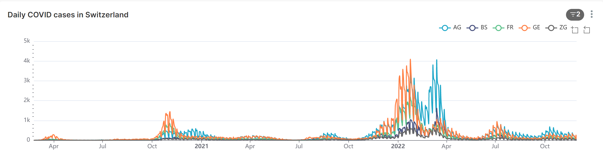

```{r include = FALSE}
# Load packages 
if(!require(pacman)) install.packages("pacman")
pacman::p_load(tidyverse, scales, lubridate, here)

```

# ggplot2 live demo: Scales and Themes

Your assignment for the first part of this workshop is to recreate a
plot from the [EpiGraphHub COVID-19 Switzerland
dashboard](https://epigraphhub.org/superset/dashboard/11) in R using
{ggplot2}.

The graph we are aiming for looks like this:



Now most of the elements shown here you have already learned how to
create: line graph, group into regions by color, add labels.

However, there are additional modifications we want to make to the
scales and themes.

I will demonstrate how to do this using a sample dataset with fake data.

```{r echo = F, warning = F}
# Create fake dataset
sample_df <- data.frame(
  month = rep(1:12, each = 31),
  day = rep(1:31, 12),
  fake_cases = sample(0:10000, size = 31*12),
  district = rep(c("D1", "D2", "D3"), 124)
  ) %>% 
  mutate(date = ymd(paste("2022", month, day, sep ="-"))) %>% 
  drop_na() %>% 
  select(date, district, fake_cases)
```

The structure of the data frame is similar to what you will use for the
workshop assignment:

```{r}
head(sample_df)
```

We can use this to make a simple time series plot using `ggplot()`.

```{r}
# Create base plot
base_plot <- ggplot(data = sample_df,
  mapping = aes(x = date,
    y = fake_cases,
    color = district)) +
  geom_line()

base_plot
```

We can add additional ggplot layers to `base_plot`, like so:

```{r}
# Add title
base_plot +
  labs(title = "Daily case counts")
```

In order to match the look of the plot we are aiming for, we need to do
the following:

1.  Change background from gray to white

2.  Relabel x-axis scale breaks to month abbreviations

3.  Remove axis titles

4.  Remove most grid lines

5.  Relabel y-axis scale breaks to shorten 1000s to "k"

We can do this with **scale** and **theme** functions from ggplot2.

```{r}
enhanced_plot <- base_plot +
  theme_minimal() +
  theme(axis.title = element_blank(),
    panel.grid.minor = element_blank(),
    panel.grid.major.x = element_blank()) +
  scale_x_date(date_breaks = "3 months",
    labels = label_date_short())

enhanced_plot
```

Four out of five tasks done!

We leave the last and step to you. Do some web searches or use ChatGPT
to learn how to shorten the y-axis numbers to add a "K" suffix. This is
so that you can practice self-learning, and using external resources,
such as [this
tutorial](https://www.roelpeters.be/scale-ggplot-y-axis-millions-or-thousands-r/)
to your own datasets.
