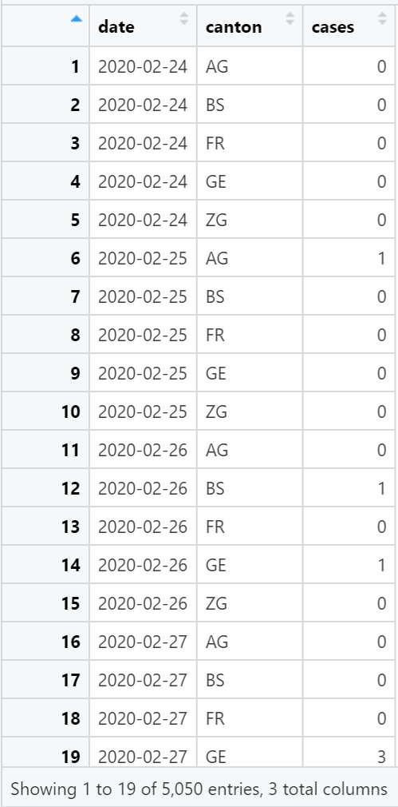

```{r include = FALSE}
knitr::opts_chunk$set(echo = FALSE)

# Load packages 
if(!require(pacman)) install.packages("pacman")
pacman::p_load(tidyverse, scales, lubridate, here)
```

# Download the data

Your assignment is to recreate a plot from the [EpiGraphHub COVID-19
Switzerland dashboard](https://epigraphhub.org/superset/dashboard/11) in
R using {ggplot2}.

Complete the following steps to get started:

1.  First, visit the website and explore the four line graphs shown on
    the dashboard: daily cases, new hospitalizations, ICU patients, or
    positive tests.

2.  As a group, choose one of the four plots to recreate in R.

3.  Download the data associated with your chosen plot by clicking the
    three dots on the top right on the plot and selecting "Export CSV"

4.  Once downloaded, move the CSV from your downloads folder to the
    "data" folder in this week's R project folder.

Now the project folder is set up, we are ready to code. Make sure you
are working in the **week_10_workshop** RStudio project (open
week_10_workshop.Rproj).

# Install and load packages

The packages you need for today are: tidyverse, scales, lubridate,
plotly, and here.

```{r}
pacman::p_load()
```

Some of these packages are new to the course and may not be installed on
your computer. Remember that we don't have to install them individually
because the `p_load()` function will kindly identify and automatically
install any new packages.

# Data wrangling

Now, **read the dataset into R**. Remember to use the `here()` function
to allow your Rmd to use project-relative paths.

```{r}
sw_covid_raw <- "WRITE_YOUR_CODE_HERE"
```

This data needs some cleaning before we can plot it.

This is the format of the downloaded data:

{width="386"}

And this is what we want it to look like:

{width="371"}

## **Step 1:** Pivot the data

Think about which columns need to be pivoted and which dplyr function
you will need to use.

```{r}
sw_covid_long <- "WRITE_YOUR_CODE_HERE"
```

## **Step 2:** Rename variables

Rename the variable to match the column names in the image above.

```{r}
sw_covid_clean <- "WRITE_YOUR_CODE_HERE"
```

Now it's ready for plotting!

# Recreate dashboard plot

First, start with a simple line graph of cases over time, and color the
lines by canton.

```{r}
sw_covid_base <- "WRITE_YOUR_CODE_HERE"

sw_covid_base
```

Then, make the following changes:

1\. Change background from gray to white

2\. Relabel x-axis scale breaks to month abbreviations

3\. Remove axis titles

4\. Remove most grid lines

5\. Relabel y-axis scale breaks to shorten 1000s to "k"

This can be done in several small steps. See the demo Rmd for example
code.

```{r}
sw_covid_egh <- "WRITE_YOUR_CODE_HERE"

sw_covid_egh
```

The {plotly} package can be used to make your plot interactive. Use the
`ggplotly()` function convert your plot. If you are unsure of how the
function works, look up examples or package documentation.

```{r}
sw_covid_plotly <- "WRITE_YOUR_CODE_HERE"

sw_covid_plotly
```

# ggplot2 extensions

As a final step in this assignment, you will explore additional
functions or packages to add new features to your line graph.

Choose AT LEAST ONE of the following plot extensions to apply to your
`sw_covid_egh` graph:

-   **Animate your line graphs with the gganimate package.** Follow the
    animation tutorial
    [here](https://r-graph-gallery.com/287-smooth-animation-with-tweenr.html).
-   **Annotate data points with `geom_label()`.** Add text annotations
    to the two highest counts on the plot by following the "Add labels
    for a selection of marker" tutorial
    [here](https://r-graph-gallery.com/275-add-text-labels-with-ggplot2.html).
-   **Compound plot with total counts.** Plot linegraph that shows the
    total counts across all cantons, similar to the small light blue
    plots under the main plots on the [EpiGraphHub
    dashboard](https://epigraphhub.org/superset/dashboard/11). Create a
    compound plot with patchwork package or cowplot package that
    contains these two plots.
-   **Rolling averages.** The current graph shows daily counts directly from the data. We can also plot 7-day rolling averages to smooth out the bumpiness in daily counts. This is often the format used in time-series plots of epidemic data. Plot a weekly rolling average on your graph by following this [tutorial](https://www.storybench.org/how-to-calculate-a-rolling-average-in-r) (or using ChatGPT).

# Presentations

Choose one person from the group to share your work with the class.

# Submission: Upload Rmd

Once you have finished the tasks above, you should **upload the Rmd** on
the assignment page.
